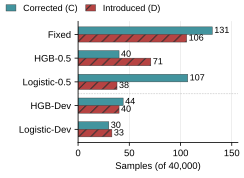

# Expert Selection in Traffic Detection

### A Controlled Study of Development Support

**Haowen Liu · Lei Zhang** — Capital Normal University  
[Project page](https://me-fake-you.github.io/traffic-expert-selection/) · [Repository](https://github.com/me-fake-you/traffic-expert-selection) · [中文说明](README.zh-CN.md) · [Reproduction guide](REPRODUCING.md) · [Evidence map](EVIDENCE_MAP.md)

> Research artifact accompanying an **author-review manuscript**, not an accepted-paper or deployment-readiness claim. Source code is released under the MIT license; data and manuscript rights are described separately.

## Master's research companion

The repository now also includes the broader **MAD-ETD thesis code and experimental record**: field-use isolation and shortcut-risk tests, specialist evidence, fusion and budgeted routing, group-shift evaluations, read-only advice, and later gain/risk and packet-prefix experiments. [Explore the thesis page](https://me-fake-you.github.io/traffic-expert-selection/thesis.html) · [Code and research map](thesis/README.md) · [实验中文说明](thesis/README.zh-CN.md).

Only code, configurations and screened aggregate evidence are released—**not the thesis full text**. These historical protocols are separate from the controlled short-paper study below. See the thesis [release scope](thesis/RELEASE_SCOPE.md) and [validation record](thesis/VALIDATION.md).



## The question

When two traffic experts disagree, does the development set contain enough information to distinguish the policies used to select between them?

This study separates **arbiter fitting support**, **candidate-level selection information**, and **realized false alarms and misses**. It examines a fixed 16-pair threshold grid, a simple reliability-rule control with the same candidate budget, an independently selected four-threshold global control, and one Stats-backend replacement. It does not introduce a guaranteed safe-switching rule.

## What the evidence shows

- With the original HGB experts, Logistic-0.5 makes 107 corrections and introduces 38 errors; Fixed makes 131 corrections and introduces 106 errors. The net difference is **44 corrections**, while the Macro-F1 difference is **+0.110 percentage points**, with a conditional interval spanning zero. These are different quantities.
- In one fold, a **unique numerical development optimum** adds 77 false alarms and removes five misses relative to Logistic-0.5. A tie-only explanation is insufficient.
- At matched composition, higher candidate coverage changes policies in one fold but produces **opposite error changes for Logistic and HGB**. Removing the recall filter changes none of 90 dependent choices.
- The same-source ExtraTrees replacement and the unsuccessful frozen IoT-23 transfer remain in the record. The original 40,000-segment experiment, natural-frequency raw execution, and external author-flow evaluation are separate populations, not a shared leaderboard.

## Start here

Python 3.11+ and NumPy are sufficient for the portable replay component.

```sh
python -m pip install -r requirements.txt
python -m unittest discover -s tests -v
python scripts/check_results.py
```

The unit tests use explicitly synthetic arrays. `check_results.py` recomputes metrics from the included aggregate confusion counts. Neither command retrains models or independently reproduces the data acquisition and fitting chain.

With the original, legally held frozen matrices and reliability records:

```sh
python -m traffic_selection.replay --matrices /path/to/candidate_matrices --references /path/to/reference_lock.json --output runs/replay_001
```

This entry point recomputes 20 finite-candidate cases, 15 simple-control choices, and nine pooled policy results on the original 40,000 segments. All choices are saved before outer-role matrices are read. Existing output directories are rejected. See [REPRODUCING.md](REPRODUCING.md) for the exact input contract and validation scope.

## Package contents

| Directory | Purpose | Reproduction level |
|---|---|---|
| `traffic_selection/` | Portable selection, exact-vector patterns, hindsight error decomposition | Executable with frozen matrices |
| `tests/` | Synthetic edge cases for rules and metric definitions | Executable without research data |
| `results/` | Recorded aggregate results, including zero and negative outcomes | Inspectable without research data |
| `archive/original/` | Byte-identical experiment scripts from the historical runs | Source inspection; original workspace dependencies required |
| `docs/` | Static project showcase, existing figures, and manuscript preview | Local preview / GitHub Pages preparation |

Historical scripts have not been converted into a turnkey end-to-end training package. Their original workspace paths and dependencies are explained in [archive/README.md](archive/README.md). The public candidate deliberately excludes raw traffic, endpoints, row-level labels/predictions, checkpoints, credentials, and private author notes.

## Data, provenance, and scope

[DATA.md](DATA.md) describes the distinct evaluation populations. [SOURCE_MANIFEST.csv](SOURCE_MANIFEST.csv) maps every copied artifact to its historical relative path and SHA-256. [EVIDENCE_MAP.md](EVIDENCE_MAP.md) connects the manuscript's claims to the specific result files and original execution code.

The analysis is exploratory on previously exposed evaluation data. Candidate-pattern counts are not independent sample counts. The finite-candidate error identity is post-hoc, not a generalization bound or an evaluation-label-selected deployment policy. Strategy call counts are not end-to-end speedups.

## License and citation

Source code and software documentation use the [MIT license](LICENSE), as authorized by the author. Please see [RELEASE_STATUS.md](RELEASE_STATUS.md) for scope. The manuscript and its scientific figures retain their authors' rights; dataset rights remain with the original providers. `CITATION.cff` describes an unpublished research artifact and has no invented DOI or venue acceptance.
